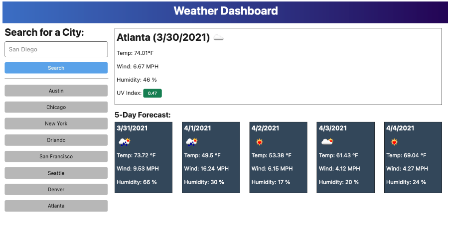

# Weather Dashboard

## User Story

 

AS A traveler
I WANT to see the weather outlook for multiple cities
SO THAT I can plan a trip accordingly

# Acceptance Criteria

GIVEN a weather dashboard with form inputs
 

<ul>
<li>WHEN I search for a city</li>
<li>THEN I am presented with current and future conditions for that city and that city is added to the search history</li>
<li>WHEN I view current weather conditions for that city</li>
<li>THEN I am presented with the city name, the date, an icon representation of weather conditions, the temperature, and the humidity, the wind speed, and the UV index</li>
<li>WHEN I view the UV index</li>
<li>THEN I am presented with a color that indicates whether the conditions are favorable, moderate, or severe</li>
<li>WHEN I view future weather conditions for that city</li>
<li>THEN I am presented with a 5-day forecast that displays the date, an icon representation of weather conditions the temperature the wind speed, and the humidity</li>
<li>WHEN I click on a city in the search history</li>
<li>THEN I am again presented with current and future conditions for that city</li>
</ul>

[Deployed Site](https://levimendyk.github.io/weather-dashboard/)

Contribution guidelines for this project

